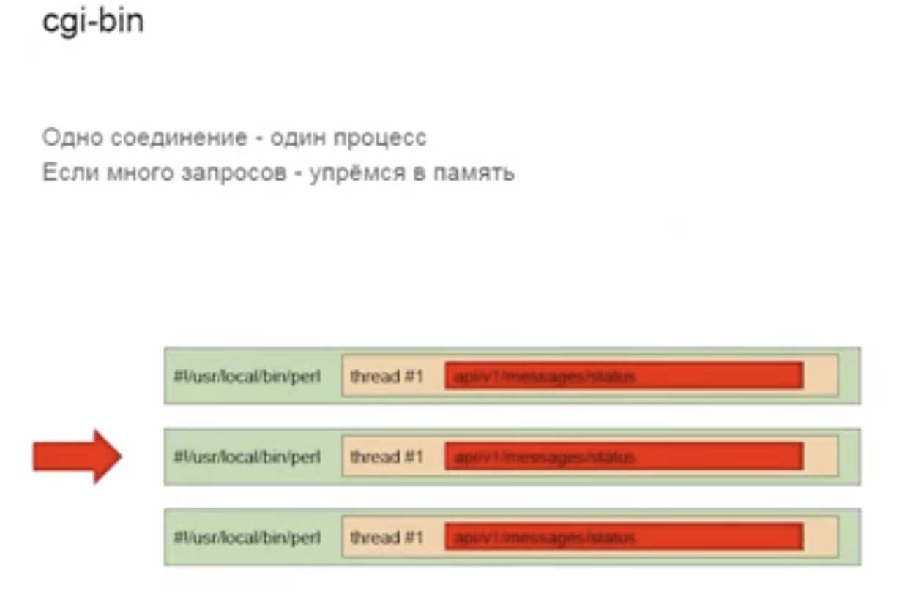

### cgi-bin

Одно соединение - один процесс. Если много запросов - упремся в память.

На каждый запрос создается новый процесс. Это операция очень тяжелая. Выполняет запрос и после этого процесс убивается.

Это неэффективно. Мы тратим много времени и ресурсов на создание и звершение процессов.

### worker pool

В этом случае у нас есть н есколько процессов, которые не убиваются после завершения запросов, а остаются в ожидании следующего запроса.

### Multithreading

Мы создаем не целый процесс, а системный тред. Тред более легкая сущность, чем процесс. Тред имеет доступ к оперативной памяти своего процесса. В нем можно переиспользовать соединения к базе данных. Тред занимает меньше памяти. Системный тред тоже выполняется процессором и у него тоже есть context switch. За счет экономии памяти мы можем обработать большее количество запросов.

Также мы можем создать worker pool и переиспользовать треды, не создавая их снова. Возможно это можно как-то ускорить? Давайте посмотрим внутрь запроса.

https://stepik.org/lesson/1131159/step/1?unit=1142756

-4:21