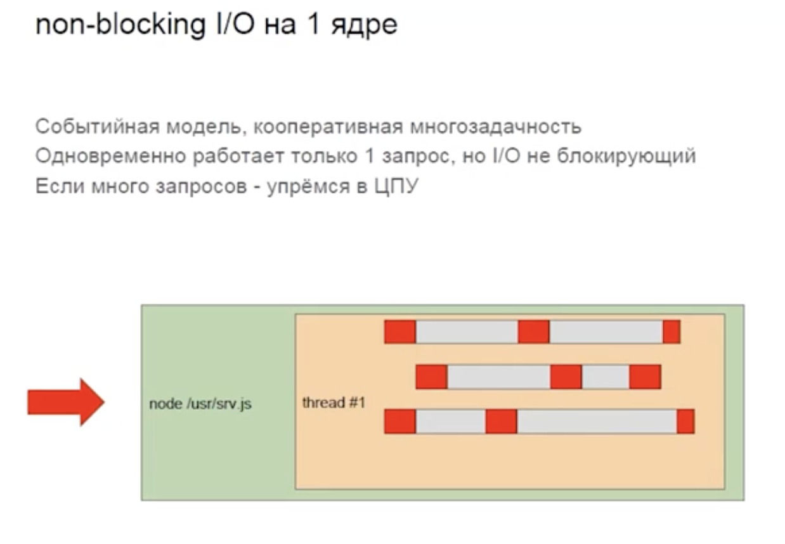
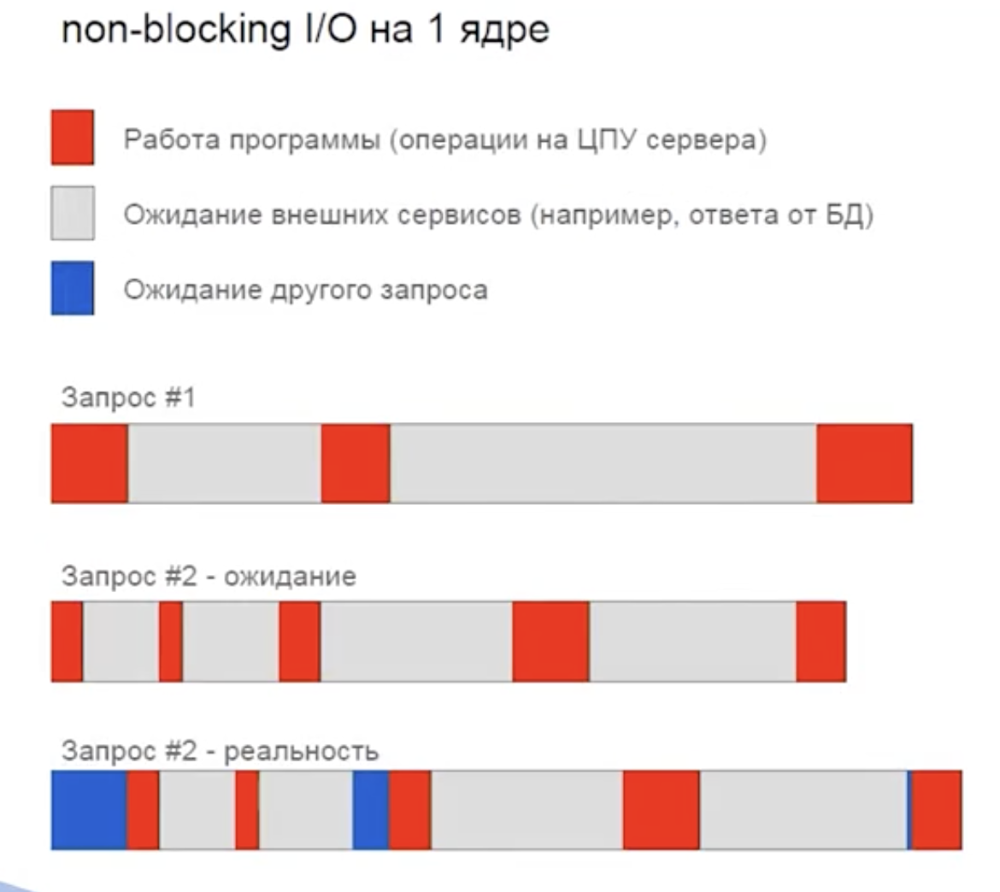
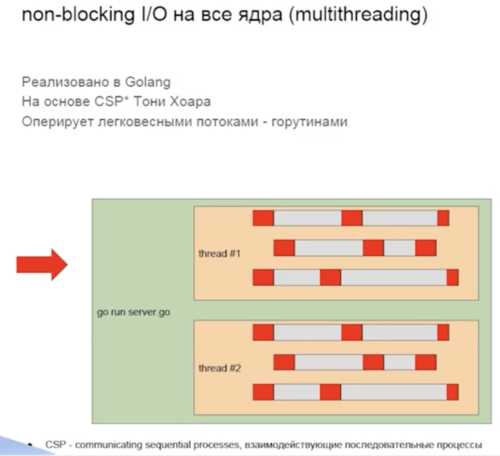

https://stepik.org/lesson/1131159/step/1?unit=1142756  -4:21

### cgi-bin

Одно соединение - один процесс. Если много запросов - упремся в память.

На каждый запрос создается новый процесс. Это операция очень тяжелая. Выполняет запрос и после этого процесс убивается.

Это неэффективно. Мы тратим много времени и ресурсов на создание и звершение процессов.

### worker pool

В этом случае у нас есть н есколько процессов, которые не убиваются после завершения запросов, а остаются в ожидании следующего запроса.

### Multithreading

Мы создаем не целый процесс, а системный тред. Тред более легкая сущность, чем процесс. Тред имеет доступ к оперативной памяти своего процесса. В нем можно переиспользовать соединения к базе данных. Тред занимает меньше памяти. Системный тред тоже выполняется процессором и у него тоже есть context switch. За счет экономии памяти мы можем обработать большее количество запросов.

Также мы можем создать worker pool и переиспользовать треды, не создавая их снова. Возможно это можно как-то ускорить? Давайте посмотрим внутрь запроса.

### А что внутри запроса?

Основное время внутри API уходит на ожидание от какой-то БД или веб-сервиса. В случае с подходом с процессами на запрос или тредами на запрос получается, что тред блокируется на ожидание ответа и не выполняет никакой полезной работы. 

### non blocking i/o на 1 ядре

Из этого понимания родился событийный подход понимания процессора, который реалиозован в node JS и JS. У нас не блокирующий ввод/вывод (I/O). После отправки запроса в БД мы не блокируемся и продолжаем выполнять какие-то другие запросы. В этом случае процессор у нас перестает бездействовать и мы получаем хорошее быстродействие. Мы можем обработаывать много запросов внутри одного треда.

### non blocking i/o на 1 ядре

Поскольку у нас всего лишь 1 системный тред мы не можем выполнять запросы параллельно. В случае с вытесняющей многозадачностью, когда один тред блокируется, начинает свою работу второй тред. В случае с кооперативной многозадачностью мы должны дождаться пока закончит свою работу первый запрос, чтобы выполнять второй запрос. Это может быть плохо, если у нас много операций на ЦПУ. Мы можем считать какие-то хэши, заниматься шифрованием или архивированием. При тяжелых процессорных операциях нам не будет хватать процессорного времени для обработки всех операций запросов. Нам хочется разнести это на несколько ядер. Для того, чтобы пока один тред занят, мы могли выполнять что-то в другом.

### non blocking i/o на все ядра (multithreading)

Такой подход реализован в Golang. Он основан на CSP (communication sequential processes - взаимодействующие последовательные процессы). Мы оперируем легковесными потоками - горутинами. Горутин - это аналог сопрограммы, когда в одном системном треде может выполняться несколько горутин. И особенностью является то, что мы можем начать выполняться на одном системном треде, допустим уйти в ожидании данных из БД, и закончить на другом, потому что первый системный тред был занят другой горутины. Это позволяет получить большую пропускную способность.
