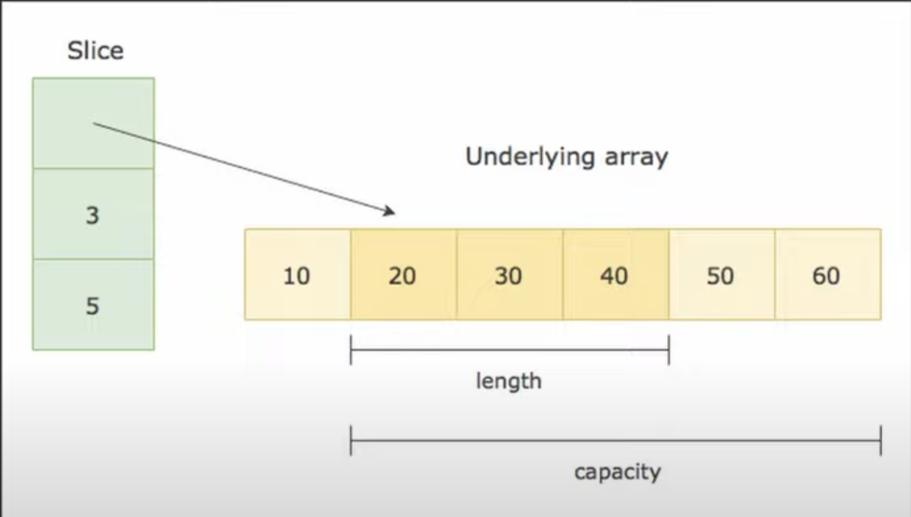

Передача слайса по ссылке или по значению

Кажется, что при передаче слайса по значению нет ничего хорошего, ведь мы копируем все элементы слайса в функцию. Но это не так, сам слайс не содержит в себе эти значения. Мы передаем структуру, а в ней хранится ссылка на первый элемент массива, длина и емкость.

Но при передаче массива по значению есть свои минусы.

16:00

17:30 в го слайсы можно делать не только от массива, но и от слайса тоже.

