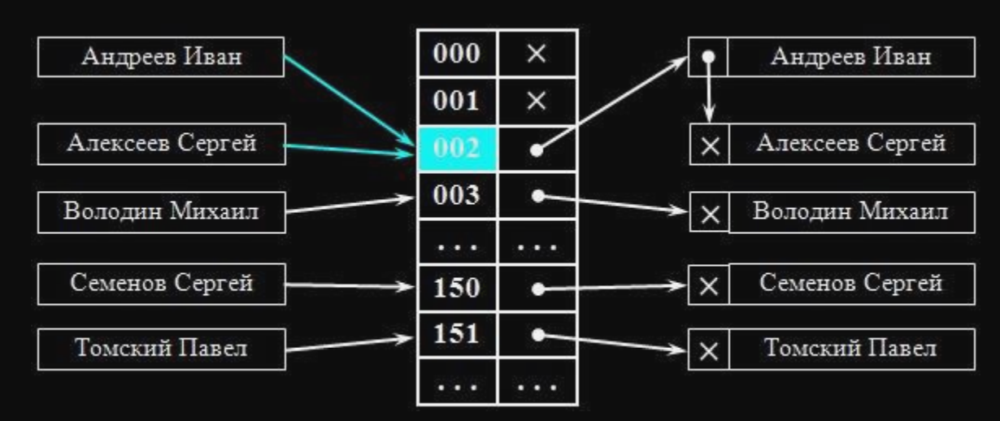
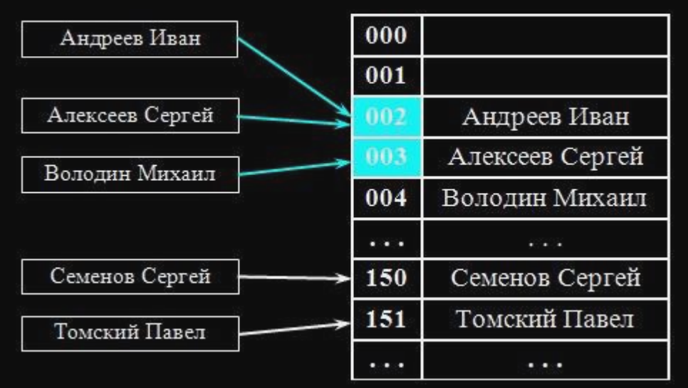

func hash1() int {
	return randomInt(100)
}

func hash2() int {
	return 1
}

У нас есть 2 функции для вычисления хеша. Нужно вставить в мапу всего лишь 10 элементов.
Какая функция для вычисления хеша больше подходит для этой цели? Какие плюсы и минусы каждой функции?

Функция `hash1` каждый раз возвращает случайный хеш. Это обеспечивает равномерное распредление по бакетам при вставке элементов в мапу. Только при чтении мы уже не сможем обратиться в тот бакет, в который положили наше значение, потому что хэш-функция вернет другое значение. Здесь происходит нарушение детерменированности и предскауемости хэш-функции.

Функция `hash2` всегда возвращает единицу. Это значит, что в мапе у нас будет 10 элементов, которые будут иметь одинаковые хеши, будет возникать большое количество коллизий. Все элементы мапы будут хранится в одном бакете. С такой функцией вычисления мапы мы получаем массив. Сложность получения элементов в худшем случае будет O(n). Функция `hash2` в отличии от `hash1` детерминированна, что является плюсом.

Что такое коллизия?
Коллизия — это ситуация при которой два разных входных элемента (ключа) дают одинаковое хеш-значение. При этом оба ключа будут помещены в один и тот же бакет в хеш-таблице. Существуют несколько методов решения коллизий. Чаще всего на собеседованиях упомниваются два нижеуказанных метода.

Какой способ применяется в го?

Методы решения коллизий:
1. Метод открытой адресации.

В каждом бакете содержится указатель на связный список, в котором хранятся все элементы мапы.

2. Метод цепочек.

Элементы мапы хранятся в массиве. При коллизии происходит поиск следующей свободной ячейки и вставка в нее элемента.