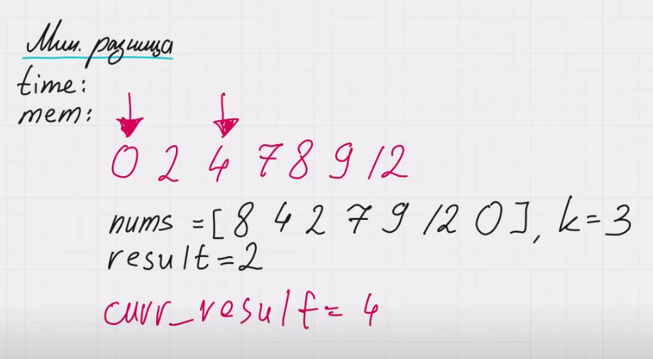
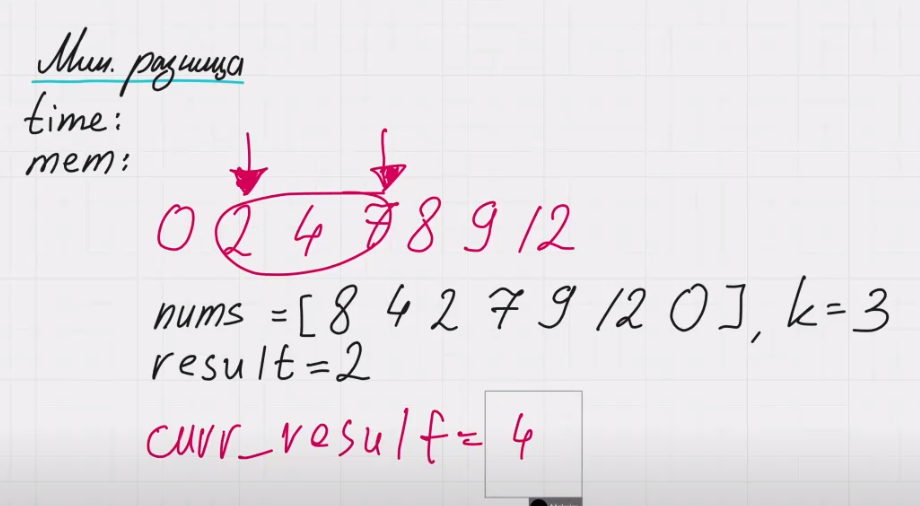

Минимальная разница между самым высоким и самым низким из K баллов

Описание задачи:
Вам дан массив целых чисел nums, где nums[i] представляет собой оценку i-го студента, и целое число k. Необходимо выбрать оценки любых k студентов из массива так, чтобы разница между самой высокой и самой низкой из выбранных оценок была минимальной. Верните минимально возможную разницу.

Пример 1:

Ввод: nums = [90], k = 1  
Вывод: 0  
Объяснение: Есть только один способ выбрать оценки одного студента: [90].  
Разница между самой высокой и самой низкой оценкой равна 90 - 90 = 0.

Пример 2:

Ввод: nums = [9, 4, 1, 7], k = 2  
Вывод: 2  
Объяснение:  
- Возможные пары (k = 2): [9, 4], [9, 1], [9, 7], [4, 1], [4, 7], [1, 7].  
- Разница между самой высокой и самой низкой оценкой минимальна для пары [4, 7]: 7 - 4 = 3.

Подсказка:
Для минимизации разницы между самой высокой и самой низкой оценкой, можно отсортировать массив nums. После сортировки, минимальная разница будет найдена среди всех подмассивов длины k.

------

nums = [8, 4, 2, 7, 9, 12, 0], k = 3  

Первое, что нам нужно сделать - это отсортировать массив. В таком случае мы можем легко найти ближайшие числа и смотреть на их разницу.

После сортировки мы получаем вот такой массив:
arr = [0, 2, 4, 7, 8, 9, 12]

Теперь мы будем использовать 2 указателя, первый будем смотреть на текущий элемент, второй на k - 1 элементов вправо: 
l = i, r = i + k - 1

Заведем переменную curr_result, которая будет высчитывать разницу между элементами левого и правого указателя: 
nums[r] - nums[l]

При каждой итерации будем сравнивать curr_result и result, будем брать наименьшее.

Далее сдвигаем указатель на 1 и снова сравниваем 2 элемента. 

И так двигаемся до тех пор, пока не дойдем до конца массива

Почему в этой задаче работает сортировка?
Допустим у нас есть в массиве число 2 и мы хотим найти ближайшие разницу между 4 элементами. На самом деле 2 может входить только в подмассив [0, 2, 4, 7] и [2, 4, 7, 8]. Другие группы из 4 элементов составлять нет смысла. Имеет смысл брать только 2 соседних числа. Только 2 соседних числа могут дать наименьшую разность.

Именно поэтому мы массив сортируем и потом проходимся по нему с помощью 2 указателей и находим минимальную разницу, которую возвращаемм в качестве ответа.

time: O(n log n)
mem: O(1)

Самая сложная операция, которую мы используем в данной задачи это сортировка. Мы будем использовать стандартную сортировку, встроенную в язык. Нужно знать какую сложность она имеет. Если используется heap sort, то mem: O(1), если quicksort или mergesort, то mem может варьироваться :от O(n) до O(logn).
