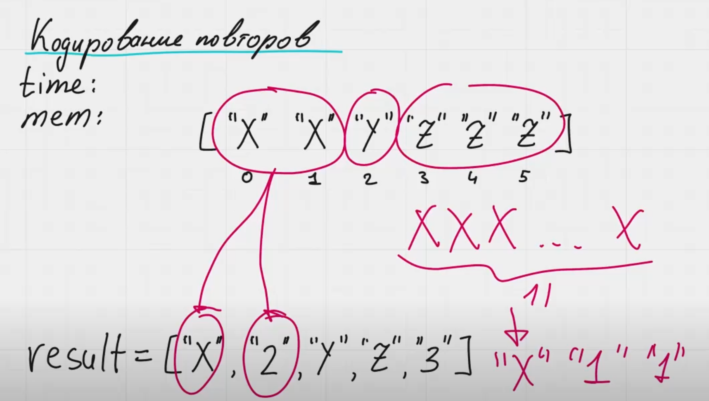

Если число символов двузначное, то каждый символ нужно отдельно. Например у нас 11 раз встречается символ 'x', значит нужно записать. Вот так:
['x', '1', '1']

time: O(n)
mem: O(n) - если учитывать размер выходного массива, O(1) - если не учитывать размер выходного массива, никаких переменных мы больше не создаем.

Есть версия задачи, в которой требуется выводить повторы в консоль
Есть версия задачи, в которой требуется записывать результат в исходном массиве. В таком случае у нас размера резултируюещго массива будеь меньше или равен входному массиву. См. пример ниже:
['x'] -> ['x']
['x', 'x'] -> ['x', '2']
['x', 'x', 'x'] -> ['x', '3']