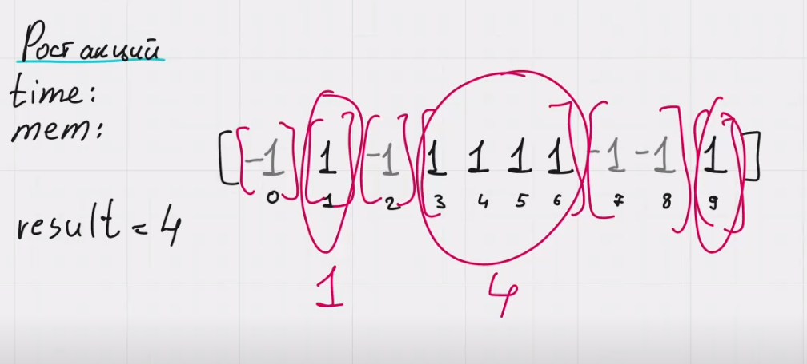

Рост акций

Нам нужно найти макимальную последовательность из единиц.

Мы будем проходиться по массиву и группировать все одинаковые числа.

Решать мы будем с помощью плавающего окна. В ней используются 2 указателя, которые указывают на начало и конец плавающего окна (l и r). 

Как будут перемещаться эти указатели?
Внутри плавающего окна мы будем смотреть у нас последовательность из единиц или нет. Если да, то считаем количество единиц и обновляем ответ maxCount при необходимости.

Следующее плавающее окно будет начинаться с указателя r + 1. Мы постоянно сравниваем текущий элемент со следующим. currRes считается по формуле r - l + 1.

time: O(n)
mem: O(1)