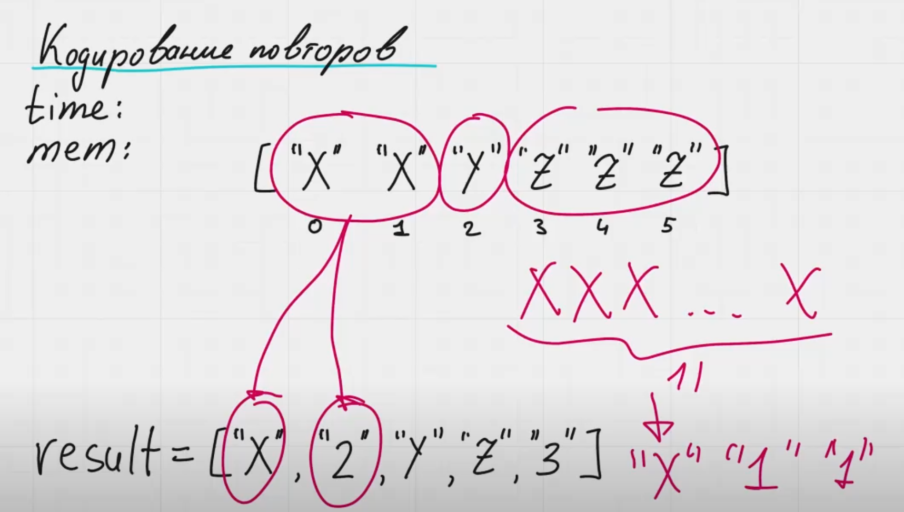

### String Compression (Сжатие строки) - LeetCode

**Описание задачи:**  
Дана строка `chars`, представленная массивом символов, необходимо сжать её, используя следующий алгоритм:  

1. Группируйте последовательные повторяющиеся символы.
2. Для каждой группы запишите символ, а затем длину группы в виде символов.  
   - Если длина группы равна `1`, записывать её не нужно.
   - Если длина группы больше `1`, её необходимо представить в виде последовательности символов (например, `12` записывается как `'1', '2'`).
3. Сжатая строка должна записываться в исходный массив `chars`, начиная с индекса `0`.  
4. Возвращаемое значение функции — новая длина массива после сжатия.

**Ограничения:**  
- `1 <= chars.length <= 2000`
- `chars[i]` — это строчная буква английского алфавита (a-z).

---

### **Примеры**  

**Пример 1:**  
**Вход:**  
```python
chars = ["a","a","b","b","c","c","c"]
```
**Выход:**  
```python
6, chars = ["a","2","b","2","c","3"]
```
**Объяснение:**  
Сжатый массив: `["a","2","b","2","c","3"]`. Длина массива — 6.

---

**Пример 2:**  
**Вход:**  
```python
chars = ["a"]
```
**Выход:**  
```python
1, chars = ["a"]
```
**Объяснение:**  
Так как символ встречается один раз, он остаётся без изменений.

---

**Пример 3:**  
**Вход:**  
```python
chars = ["a","b","b","b","b","b","b","b","b","b","b","b","b"]
```
**Выход:**  
```python
4, chars = ["a","b","1","2"]
```
**Объяснение:**  
Группа из `b` повторяется 12 раз, поэтому сжатие приводит к `["a","b","1","2"]`. Длина массива — 4.

---

**Пример 4:**  
**Вход:**  
```python
chars = ["a","a","a","b","b","a","a"]
```
**Выход:**  
```python
6, chars = ["a","3","b","2","a","2"]
```
**Объяснение:**  
Сжатие приводит к `["a","3","b","2","a","2"]`. Длина массива — 6.

---

Задача требует **модификации входного массива `chars` на месте** без использования дополнительного хранилища для строки.


------


Если число символов двузначное, то каждый символ нужно отдельно. Например у нас 11 раз встречается символ 'x', значит нужно записать. Вот так:
['x', '1', '1']



time: O(n)
mem: O(n) - если учитывать размер выходного массива, O(1) - если не учитывать размер выходного массива, никаких переменных мы больше не создаем.

Есть версия задачи, в которой требуется выводить повторы в консоль
Есть версия задачи, в которой требуется записывать результат в исходном массиве. В таком случае у нас размера резултируюещго массива будеь меньше или равен входному массиву. См. пример ниже:
['x'] -> ['x']
['x', 'x'] -> ['x', '2']
['x', 'x', 'x'] -> ['x', '3']