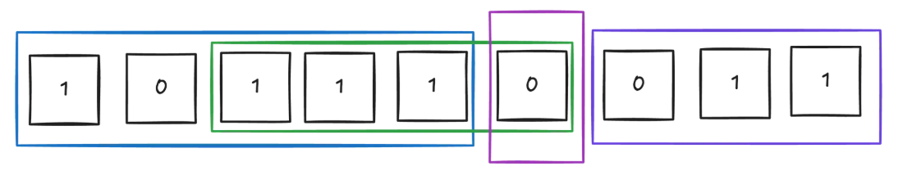

# 2. Пересекающиеся окна

## В уроке ты:

- Разберешь задачу с собеседования в BigTech
- Научишься применять паттерн "пересекающиеся плавающие окна", чтобы решать задачи на собеседовании с первой попытки
- Научишься оценивать время и память алгоритмов с использованием этого паттерна

## Пример задачи с собеседования

Ты уже освоил паттерн "непересекающиеся окна", но есть и более сложные задачи на плавающие окна. Давай рассмотрим условие одной из них, где изученного ранее паттерна будет недостаточно.

### Условие

Дан массив `nums`, состоящий только из нулей и единиц. Нужно вернуть максимальное число подряд идущих единиц при условии, что можно заменить один ноль на единицу.

### Пример

```
Ввод: nums = [1,0,1,1,1,0,0,1,1]
Вывод: 5
Объяснение: нужно заменить первый ноль на единицу.
```

### В чем сложность задачи



Давай выделим все потенциальные подмассивы, которые могут нас интересовать. Мы получим следующие подмассивы, содержащие не более одного нуля: `[1,0,1,1,1]`, `[1,1,1,0]`, `[0]`, `[0,1,1]`. Можно заметить, что эти подмассивы пересекаются, и поэтому не получится использовать ранее изученный паттерн "непересекающиеся окна".

### Общий алгоритм решения

Мы будем действовать по следующему алгоритму: заведём два указателя `l` и `r`, где `l` указывает на начало плавающего окна, а `r` — на его конец (включительно).

1. Будем двигать правый указатель `r` вправо, пока `r + 1` меньше длины массива и (элемент `nums[r+1]` равен `1` или количество нулей в окне `zerosCount` меньше `1`). То есть, пока можем добавить следующий элемент в окно.

2. Если при сдвиге правого указателя встречаем ноль и он единственный в окне, то запоминаем его индекс в `zeroIdx` и увеличиваем `zerosCount`.

3. Если не можем двигать правый указатель, значит достигнут максимальный размер окна при текущем `l`. Обновляем ответ: `result = max(result, windowSize)`, где `windowSize = r - l + 1`.

4. Сдвигаем левый указатель `l` на `1` вправо и, если элемент `nums[l]` был нулём, уменьшаем `zerosCount`. Это позволяет нам передвинуть окно и продолжить поиск.

5. Повторяем шаги 1–4, пока левый указатель `l` не достигнет конца массива.

``` python
from typing import *

def longestStockGrowth(stock: List[int]) -> int:
    l = 0
    r = 0
    result = 0
    zerosCount = stock[0] == 0
    zeroIdx = 0

    while l < len(stock):
        while r + 1 < len(stock) and (stock[r + 1] == 1 or zerosCount < 1):
            if stock[r + 1] == 0:
                zerosCount += 1
                zeroIdx = r + 1
            r += 1
        
        # обновляем ответ
        windowSize = r - l + 1
        result = max(result, windowSize)

        # сдвигаем на zeroIdx когда у нас есть 0 в окне
        # сдвигаем на l + 1 если нулей в окне нет (нужно чтобы не зациклиться)
        zerosCount = 0
        l = max(zeroIdx + 1, l + 1)
    return result
```

``` go
package main

import (
)

/**
 * Находит длину самой длинной последовательности роста акций с не более чем одним нулем.
 */

/**
 * longestStockGrowth находит длину самой длинной последовательности роста акций с не более чем одним нулем.
 *
 * @param stock - Срез целых чисел, представляющих рост акций (1) и падение (0).
 * @return int - Максимальная длина последовательности.
 */
func longestStockGrowth(stock []int) int {
    l := 0 // Левый указатель окна
    r := 0 // Правый указатель окна
    result := 0 // Результирующая максимальная длина
    zerosCount := 0 // Количество нулей в текущем окне
    zeroIdx := -1 // Индекс последнего нуля в окне

    if len(stock) > 0 && stock[0] == 0 {
        zerosCount = 1
        zeroIdx = 0
    }

    for l < len(stock) {
        // Расширяем окно, пока следующий элемент 1 или количество нулей меньше 1
        for r+1 < len(stock) && (stock[r+1] == 1 || zerosCount < 1) {
            if stock[r+1] == 0 {
                zerosCount += 1
                zeroIdx = r + 1
            }
            r += 1
        }

        // обновляем ответ
        windowSize := r - l + 1
        if windowSize > result {
            result = windowSize
        }

        // сдвигаем на zeroIdx когда у нас есть 0 в окне
        // сдвигаем на l + 1 если нулей в окне нет (нужно чтобы не зациклиться)
        zerosCount = 0
        if zeroIdx != -1 {
            l = max(zeroIdx+1, l+1)
        } else {
            l = l + 1
        }
    }

    return result
}

// Функция для вычисления максимума двух чисел
func max(a, b int) int {
    if a > b {
        return a
    }
    return b
}
```


### Паттерн "непересекающиеся плавающие окна"

Чтобы не придумывать решение для каждой новой задачи на пересекающиеся окна, можно следовать общему паттерну:

``` go
package main

func calculate(nums []int) []string {
    l := 0
    // обрати внимание, что r = -1
    r := -1
    // ...
    var result []string
    // Возможно, нужна дополнительная инициализация, например, counter

    for l < len(nums) {
        for r+1 < /* len(counter) */ && /* тут условие, что следующий элемент можно взять в окно */ &&
            // возможна пополнительная обработка ... 
         {
            r += 1
         }

        // обновляем ответ
        // ...

        // обновляем состояние плавающего окна перед сдвигом
        // ...

        // сдвигаем левый указатель
        l = l + 1
    }
    return result
}
```

Для даннего паттерна действуют следующие правила:

- Начальное положение указателей чаще всего `l = 0`, а `r = -1` – это сделано, чтобы добавление первого элемента в плавающее окно не делалось отдельно, а согласно общему алгоритму
- Сдвиг правого указателя не нарушает правила плавающего окна и всегда формирует такое окно, на основании которого можно получить верный ответ
- Обновление ответа происходит после сдвига правого указателя максимально далеко
- Левый указатель сдвигается всегда на 1, что позволяет рассмотреть все возможные не пересекающиеся окна

### Решение на основе паттерна

Чтобы каждый раз не придумывать решение для новой задачи на “пересекающиеся окна” можно следовать паттерну:

``` go
package main


/**
 * Вычисляет длину самой длинной последовательности роста акций.
 *
 * @param stock - Срез значений акций.
 * @return int - Длина самой длинной последовательности.
 */
func longestStockGrowth(stock []int) int {
    l := 0
    // r = -1, чтобы добавление первого элемента не было исключением
    r := -1
    result := 0
    zerosCount := 0

    for l < len(stock) {
        for r+1 < len(stock) && (stock[r+1] == 1 || zerosCount < 1) {
            if stock[r+1] == 0 {
                zerosCount += 1
            }
            r += 1
        }

        // обновляем ответ
        windowSize := r - l + 1
        if windowSize > result {
            result = windowSize
        }

        if stock[l] == 0 {
            zerosCount -= 1
        }
        l += 1
    }
    return result
}
```

Решение на основе паттерна оптимально с точки зрения ассимптотики и время алгоритма `O(n)`, а память `O(1)`

### **Всегда ли решать на основе паттерна**

Я ставлю своей главной задачей показать тебе множество вариантов решения различных задач, чтобы ты мог выбрать подходящий тебе вариант. Каждая задача имеет свой красивое решение и большинство из них будут не следовать паттерну, а исходить из уникального условия конкретной задачи

Я хочу, чтобы у тебя всегда был в кармане “ключ”, которым ты можешь решить множество задач без ошибок и именно поэтому рассказываю тебе про паттерны. Использовать паттерны или нет – решение всегда за тобой. Но лично меня они не раз спасали на собеседованиях, когда уже почти терял надежду решить задачу. Уверен, что и тебе они так же помогут в критический момент!

## Что дальше?

С первого раза сложно понять в чем смысл каждого из пунктов, поэтому не погружйся в самом начале в урок слишком глубоко. Если ты прочитал урок несколько раз и понял основной смысл, то скорее переходи к задачкам!

Именно задачи помогут отточить все навыки и на конкретных примерах ты поймешь все ньюансы, которые важно знать, чтобы на собеседовании решать все задачи быстро и с первого раза!