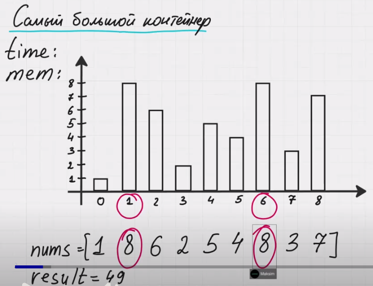

# **Контейнер с наибольшим количеством воды**

## **Условие**
Дан массив `nums`, где каждое число обозначает высоту вертикальной балки. Нужно выбрать две балки таким образом, чтобы между ними могло поместиться как можно больше воды.

## **Пример**
Рассмотрим массив:

```
nums = [1, 8, 6, 2, 5, 4, 8, 3, 7]
```

Каждое число представляет собой высоту балки, а расстояние между индексами — ширину контейнера. Чтобы вычислить объем воды, который они могут удерживать, нужно взять **минимальную высоту** из двух выбранных балок и умножить её на расстояние между ними.


Например, выберем балки с индексами `1` и `6`:
- Обе балки имеют высоту `8`
- Расстояние между ними: `6 - 1 = 5`
- Максимальный объем воды: 
$\min(8, 8) \times 5 = 40$

Наша цель — найти **максимальный возможный объем**.



---

## **Оптимальное решение: метод двух указателей**
### **Идея**
Чтобы эффективно найти максимальный объем, используем стратегию **двух указателей**:
- **Один указатель** (`left`) ставим в начало массива (`0`).
- **Второй** (`right`) — в конец массива (`n-1`).
- Вычисляем текущую площадь (`min(height[left], height[right]) * (right - left)`).
- **Обновляем `max_area`**, если текущая площадь больше.
- **Двигаем указатель, который стоит на меньшей высоте**, так как только это может привести к увеличению возможного объема воды.
- Повторяем, пока указатели не встретятся.

---

**Какой указатель нам следует двигать — левый или правый?**

Если мы попробуем двигать правый указатель, то площадь больше не станет. Почему? Потому что мы ограничены минимальной высотой элемента с индексом `[0]`. Двигая правый указатель, мы уменьшаем расстояние между указателями (длину), но высота при этом не увеличивается. Это означает, что площадь станет только меньше.  

Таким образом, двигать правый указатель **невыгодно**, так как мы не сможем получить площадь больше текущей.  

Следовательно, **нам нужно двигать левый указатель**, который стоит на минимальном элементе. Это единственный способ потенциально увеличить площадь, так как высота может стать больше.

## **Разбор работы алгоритма на примере `nums = [1, 8, 6, 2, 5, 4, 8, 3, 7]`**
---

### **Шаг 1**: Начальное положение указателей
- `left = 0`, `right = 8`
- Минимальная высота: `min(1, 7) = 1`
- Расстояние: `8 - 0 = 8`
- Площадь: `1 * 8 = 8`
- **Максимальная площадь = 8**

Двигаем **левый указатель**, так как `nums[0]` минимальный.

---

### **Шаг 2**: `left = 1`, `right = 8`
- Минимальная высота: `min(8, 7) = 7`
- Расстояние: `8 - 1 = 7`
- Площадь: `7 * 7 = 49`
- **Обновляем `max_area = 49`**

Двигаем **правый указатель**, так как `nums[8] < nums[1]`.

---

### **Шаг 3**: `left = 1`, `right = 7`
- Минимальная высота: `min(8, 3) = 3`
- Расстояние: `7 - 1 = 6`
- Площадь: `3 * 6 = 18`
- `max_area` остается `49`

Двигаем **правый указатель**.

---

### **Шаг 4**: `left = 1`, `right = 6`
- Минимальная высота: `min(8, 8) = 8`
- Расстояние: `6 - 1 = 5`
- Площадь: `8 * 5 = 40`
- `max_area` остается `49`

Обе балки равны, можем двигать любой указатель. Двигаем **правый**.

---

### **Шаг 5**: `left = 1`, `right = 5`
- Минимальная высота: `min(8, 4) = 4`
- Расстояние: `5 - 1 = 4`
- Площадь: `4 * 4 = 16`
- `max_area` остается `49`

Двигаем **правый указатель**.

---

### **Шаг 6**: `left = 1`, `right = 4`
- Минимальная высота: `min(8, 5) = 5`
- Расстояние: `4 - 1 = 3`
- Площадь: `5 * 3 = 15`
- `max_area` остается `49`

Двигаем **правый указатель**.

---

### **Шаг 7**: `left = 1`, `right = 3`
- Минимальная высота: `min(8, 2) = 2`
- Расстояние: `3 - 1 = 2`
- Площадь: `2 * 2 = 4`
- `max_area` остается `49`

Двигаем **правый указатель**.

---

### **Шаг 8**: `left = 1`, `right = 2`
- Минимальная высота: `min(8, 6) = 6`
- Расстояние: `2 - 1 = 1`
- Площадь: `6 * 1 = 6`
- `max_area` остается `49`

Алгоритм завершен.

---

## **Что делать, если балки одинаковой высоты?**
Если `nums[left] == nums[right]`, можно двигать **любой** из указателей. В любом случае мы рассмотрим все возможные пары, которые могут дать нам максимальный объем.

### **Различные случаи**
1. **Оба следующих элемента меньше текущих**  
   - Мы их все равно проверим в следующих шагах.

2. **Один из следующих элементов больше текущего**  
   - Мы обязательно дойдем до него в дальнейших шагах.

3. **Оба следующих элемента выше текущих**  
   - Порядок их рассмотрения **не влияет** на итоговый результат.

Таким образом, **наш алгоритм проходит по массиву всего один раз**, не пропуская ни одной важной комбинации.


---

## **Анализ сложности**
- **Временная сложность**: `O(n)`, так как каждый элемент обрабатывается **ровно один раз**.
- **Дополнительная память**: `O(1)`, так как мы используем **только два указателя**.
