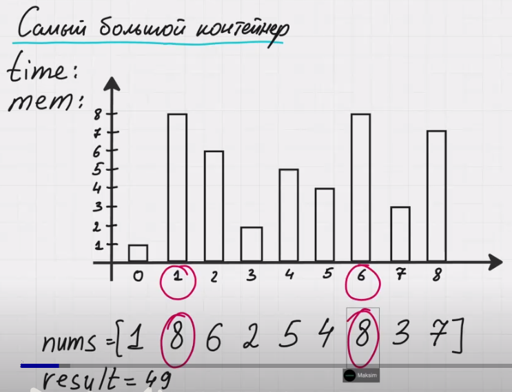
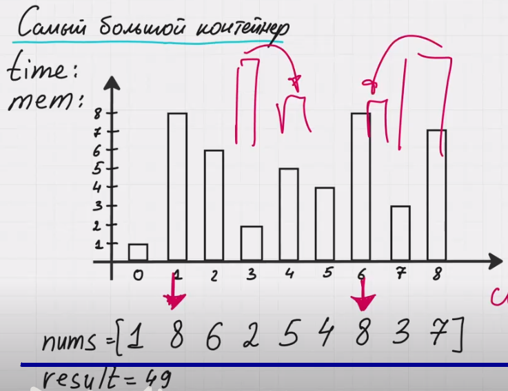

Контейнер с наибольшим количеством воды

По условию задачи нам дан массив nums и каждое из этих чисел обозначает высоту некоторой балки. Нам нужно выбрать 2 эти балки таким образом, чтобы туда поместилось туда как можно больше воды.

Для примера возьмем балки с индексом 1 и с индексом 6. У каждой балки высота 8. Чтобы посчитать объем нужно взять минимальную высоту, потому что если мы будем наливать больше чем воды чем это высота, она будет переливаться через край. Берем эту высоту и перемножаем на разницу позиций этих балок. 
8 * (6 - 1) = 40
По условию задачи нам нужно найти максимальный объем.

Для быстрого вычисления данного ответа нам потребуется 2 указателя. Мы будем использовать паттерн с 2 сторон. Мы будем двигать один из указателей, вычислять текущую площадь, обновлять, если она больше текущей максимальной и потом снова каким-то образом двигать другой указатель.

В самом начале указатели стоят на крайних элементах [0] и [8]. Площадь вычисляется как минимальное из двух чисел умноженное на длину, где длина разность индексов 8 - 0 = 8. Текущая площадь будет равна 8 * 1 = 8. Обновили максимальную площадь.

Теперь какой нам из указателей стоит двигать, левый или правый?
Если мы будем двигать правый указатель, то площадь больше у нас никак не получится, т.к. мы ограничены высотой элемента с индексом [0] - она минимальная. Когда мы будем двигать указатель мы уже уменьшим длину, но при этом высота у нас не увеличится. Получается, что нам не выгодно двигать правый указатель, потому что площадь больше чем текущая мы никак не получим. Значит нам нужно двигать левый указетель - указатель, который стоит на минимальном элементе.

Подвинули правый указатель. Теперь указатели стоят на элементах [1] и [7]. Площадь вычисляется как минимальное из двух чисел умноженное на длину, где длина разность индексов 8 - 1 = 7. Текущая площадь будет равна 7 * 7 = 49. Обновили максимальную площадь.

Подвинули правый указатель. Теперь указатели стоят на элементах [1] и [6]. Площадь вычисляется как минимальное из двух чисел умноженное на длину - 8, где длина разность индексов 5 - 1 = 5. Текущая площадь будет равна 6 * 3 = 18. Идем далее.
Здесь интересная ситуация оба элемента равны 8. Какой из указателей нам нужно подвинуть? Мы говорили, что нужно двигать меньший указатель, но здесь они равны. В этом случае мы можем подвинуть любый указатель и во всех случаях мы рассмотрим все важные балки, которые могут дать нам максимальный ответ. Рассмотрим случаи, которые могут нас ожидать:

Случай в котором  оба следующих элемента меньше

