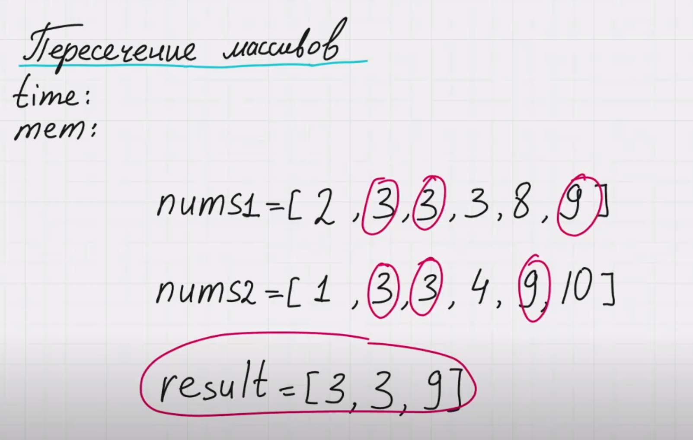

https://www.interviewbit.com/problems/intersection-of-sorted-arrays/

Пересечение массивов (задача не из leetcode)
Есть похожая задача на leetcode 350_intersection-of-two-arrays-ii. Только там массивы неотсортированы и метод с двумя указателями не сработает.

Возрастающий массив - 1, 2, 3, 4
Монотонно возрастающий массив - 1, 2, 2, 3, 4, 4 (у нас могут быть дубликаты чисел)

