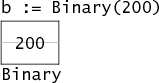

### Что такое интерфейс?

Интерфейс - это специальный тип в Go, который представляет из себя набор сигнатур методов. Чтобы его объявить нужно ключевое слово type, его название, ключевое слово interface и в фигурных скобках указать сигнатуры методов.

В го интерфейсы поддерживает встраивание. Для этого нужно в объявлении нового указать название какого-то другого интерфейса.

### [Значение интерфейса](https://go.dev/tour/methods/11)

Значение интерфейса можно рассматривать как кортеж из значения и конкретного типа:

`(value, type)`

Значение интерфейса содержит значение определенного базового конкретного типа.

Вызов метода для значения интерфейса выполняет метод с тем же именем для его базового типа.

Пример создания значения интерфейсного типа:
Создадим интерфейс Runner с методом Run().
Для создания значения интерфейсного типа используем ключевое слово var, название переменной и название созданного интерфейса. Через конструкцию Printf выведем на экран значение и тип интерфейса.


Пример создания значения интерфейсного типа:

Создадим свой пользовательский тип Binary с двумя методами `String() string` и `Get() uint64`.

```go
type Binary uint64

func (i Binary) String() string {
    return strconv.Uitob64(i.Get(), 2)
}

func (i Binary) Get() uint64 {
    return uint64(i)
}
```
Создадим экземпляр нашей структуры и присвоим ему значение:



Значение интерфейса представлены в виде пары из двух машинных слов, дающей указатель на информацию о типе, хранящемся в интерфейсе, и указатель на связанные данные.


(Указатели, содержащиеся в значении интерфейса, выделены серым цветом, чтобы подчеркнуть, что они неявные и не доступны напрямую программам Go.)

Первое слово в значении интерфейса указывает на таблицу интерфейсов `itable`. В нем хранится информация о конкретном типе `type` и списке указателей на методы `fun[0]`. В нашем случае `type`- `Binary`, методы `String() string` и `Get() uint64`.

Второе слово указывает на значение `data`. В нашем случае `data` - 200.

Через конструкцию `fmt.Printf("Value %v, type %T\n", num, num)` выведем на экран значение и тип интерфейса. Получим:

``` bash
Value 11001000, type main.Binary
```