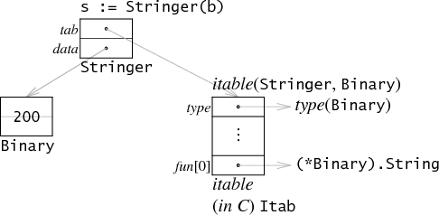

### Что такое интерфейс?

Интерфейс - это специальный тип в Go, который представляет из себя набор сигнатур методов. Чтобы его объявить нужно ключевое слово type, его название, ключевое слово interface и в фигурных скобках указать сигнатуры методов.

В го интерфейсы поддерживает встраивание. Для этого нужно в объявлении нового указать название какого-то другого интерфейса.

### [Значение интерфейса](https://go.dev/tour/methods/11)

Значение интерфейса можно рассматривать как кортеж из значения и конкретного типа:

`(value, type)`

Значение интерфейса содержит значение определенного базового конкретного типа.

Вызов метода для значения интерфейса выполняет метод с тем же именем для его базового типа.

### Пример создания значения интерфейсного типа:


Создадим интерфейс Animal, который требует реализации метода Speak().
``` go
type Animal interface {
    Speak() string
}
```

Затем мы создаем переменную animal интерфейсного типа Animal:
``` go
var animal Animal
```

Через конструкцию `fmt.Printf("Value %v, type %T\n", animal, animal)` выведем на экран значение и тип интерфейса `animal`. Увидим следующие сообщение:

``` bash
Value <nil>, type <nil>
```

Здесь мы видим, что `value` и `type` равны nil. Это означает, что переменная animal не содержит никакого значения и не указывает на конкретный тип. 

При попытке сравнить интерфейс с nil мы видим, что сообщение "animal is not nil" не распечатается.

Создадим указатель на новый объект Dog и присвоим dog интерфейсу animal.

``` go
dog := &Dog{}
animal = dog
```

Теперь, когда animal указывает на объект Dog, мы можем вызвать метод Speak. Это безопасно, потому что Dog реализует метод Speak, требуемый интерфейсом Animal.

``` go
animal.Speak() // OK
```

Снова волспользуемся конструкцией `fmt.Printf("Value %v, type %T\n", animal, animal)` выведем на экран значение и тип интерфейса. Увидим следующие сообщение:

``` bash
Value &{}, type *main.Dog
```

Тип: %T показывает, что animal — это указатель на Dog (*main.Dog).

Затем мы проверяем, не равна ли animal nil:

``` go
if animal != nil {
    fmt.Println("animal is not nil")
}
```

Поскольку animal указывает на объект Dog, условие выполняется, и выводится сообщение "animal is not nil".

Изменим поле Name у объекта Dog, на который указывает dog

``` go
dog.Name = "Шайтан"
```

Выводем снова через `Printf` тип и значение переменной animal:

``` go
Value &{Шайтан}, type *main.Dog
```

Теперь значение интерфейса поля Name обновлено до "Шайтан", что видно в выводе.

### Неявная имплементация

В Go используется неявная имплементация. В других языках требуется использование ключевого слово implements. У нас используется утиная типизация. Для того, чтобы имплементировать интерфейс необходимо реализовать все его методы. При этом можно реализовать больше методов чем это требуется, но меньше нельзя. Один тип может имплементировать несколько интерфейсов.


### Вызов метода интерфейсного типа
Значение интерфейсного типа != nil, когда
конкретный тип != nil. Мы можем безопасно вызвать метод у интерфейса только в случае, когда значение интерфейсного типа != nil. В противном случае при вызове метода мы словим панику.

### Пустой интерфейс

Пустой интерфейс - это интерфейс, у которого отсутствуют методы. Для имплементации интерфейса нужно реализовать всего его методы. Для имплементации пустого интерфейса не нужно реализовывать никаких методов. Соответственно, любой тип в go имплементирует пустой интерфейс. В других языках программирования такое называется `any`. В go тоже есть `any`, это алиас (пользовательский тип) на пустой интерфейс.

При создании переменной пустого интерфейса в дальнейшем мы можем присвоить ей любой тип. 

```go
var emptyInterface interface{}

emptyInterface = dog

emptyInterface = 123

emptyInterface = true
```

### Второй пример создания значения интерфейсного типа:

Создадим свой пользовательский тип Binary с двумя методами `String() string` и `Get() uint64`.

```go
type Binary uint64

func (i Binary) String() string {
    return strconv.Uitob64(i.Get(), 2)
}

func (i Binary) Get() uint64 {
    return uint64(i)
}
```

Создадим экземпляр нашей структуры и присвоим ему значение:


Значение интерфейса представлены в виде пары из двух машинных слов, дающей указатель на информацию о типе, хранящемся в интерфейсе, и указатель на связанные данные.


(Указатели, содержащиеся в значении интерфейса, выделены серым цветом, чтобы подчеркнуть, что они неявные и не доступны напрямую программам Go.)

Первое слово в значении интерфейса указывает на таблицу интерфейсов `itable`. В нем хранится информация о конкретном типе `type` и списке указателей на методы `fun[0]`. В нашем случае `type`- `Binary`, методы `String() string` и `Get() uint64`.

Второе слово указывает на значение `data`. В нашем случае `data` - 200.

Через конструкцию `fmt.Printf("Value %v, type %T\n", num, num)` выведем на экран значение и тип интерфейса. Получим:

``` bash
Value 11001000, type main.Binary
```

### Полиморфизм

Это когда у метода может быть своя сигнатура, но реализация у каждого своя.
