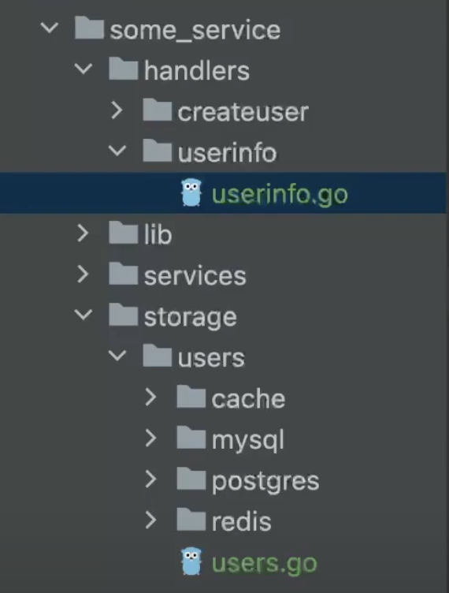
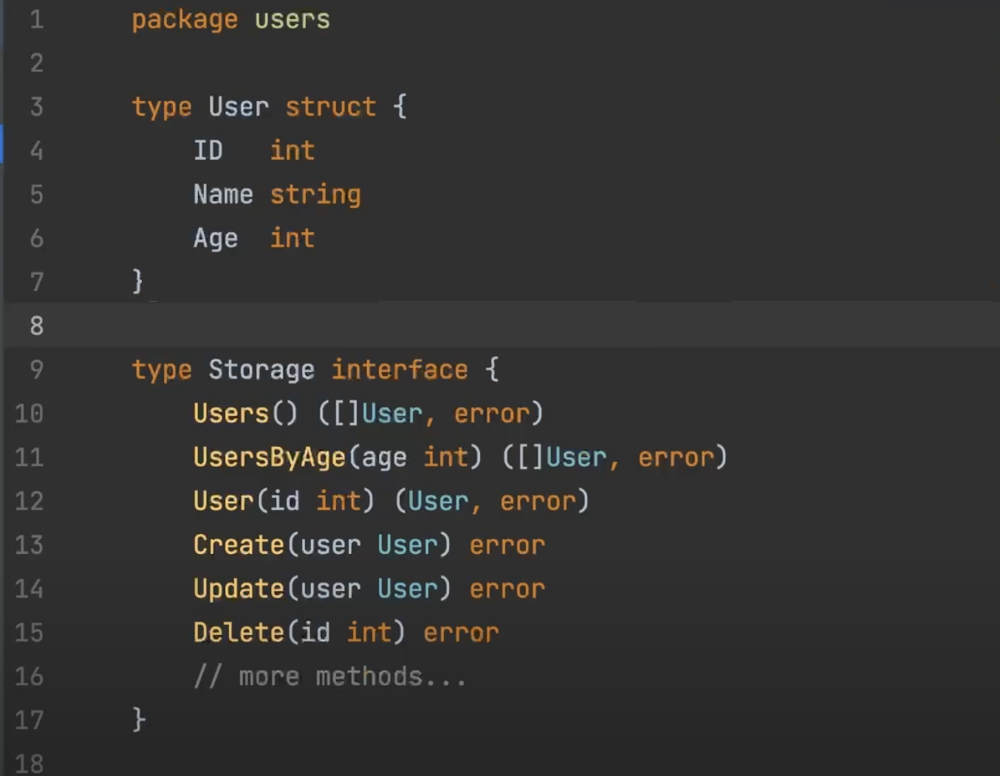
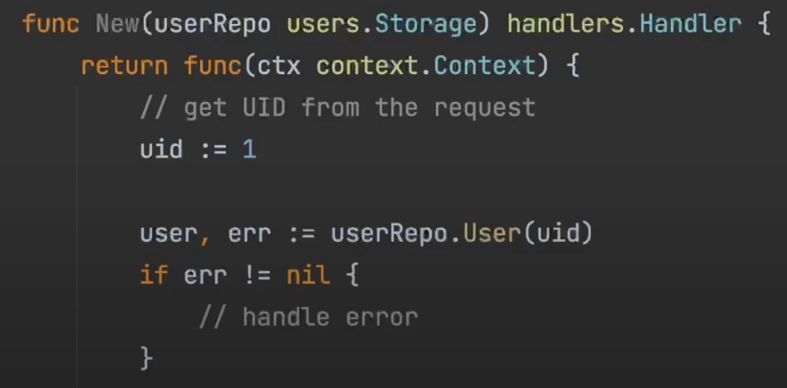
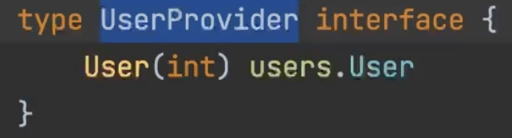

### [Где лучше размещать интерфейс?](https://www.youtube.com/watch?v=eYHCCht8eX4)

Короткий ответ - интерфейсы лучше размещать в месте их использования. Рекомендации:
1. Интерфейсы должны быть минималистичными.
2. Интерфейс ничего не должен знать о типах, которые его реализуют

Рассмотрим пример некого сервиса.
В этом сервисе нас интересует два слоя: `storage` и `handlers`. В слое `storage` есть пакет `users`, в котором указаны методы для различных БД: `Postgres`, `Redis`, `MySQL` и т.д.

Чтобы не зависеть от типа реализации мы решили описать общий интерфейс, который называется `Storage`. В общем интерфейсе содержаться все методы, которые необходимы для взаимодействия со всеми БД.

Кажется, что мы соблюдаем правило №2 - интерфейс ничего не должен знать о типах, которые его реализуют, но это не совсем так.

Мы используем данный интерфейс в слой `handlers`. В частности, в нем у нас есть функция `New`, которая принимает интерфейс `Storage`, в котором множество методов.

Чтобы не тащить за собой огромный интерфейс с кучей методов, мы можем описать интерфейс в месте его использования, прямо в этом хендлере. В этом хендлере мы используем один единственный метод `User()`. Это значит, что мы можем создать здесь интерфейс, в котором будет необходимый метод. Создадим интерфейс UserProvider, в котором будет метод `User()`.

#### Что нам это дает?

- **Минималистичный интерфейс**: В нашем методе нет намека на какую-либо базу данных. Метод `User()` просто каким-то образом возвращает пользователя.
- **Уменьшение связности**: Пакет `handlers` никак не зависит от пакета `storage`. Связность компонентов системы должна быть как можно меньше.
- **Понятность кода**: Мы сделали ясными ожидания и потребности разных частей системы. При чтении кода в пакете `handlers`, мы видим, какой интерфейс ожидает функция, и этот интерфейс описан в этом же пакете. При использовании большого интерфейса `Storage`, мы видим, что у него много методов, и не сразу понятно, для чего они нужны. Также, чтобы прочитать описание интерфейса, нужно перейти в другой пакет.
- **Гибкость системы**: Допустим, мы хотим передать вместе с сущностью `Postgres` сущность `Redis`. Чтобы соответствовать данному интерфейсу, нам придется реализовать все его методы, даже если они не используются.
- **Тестирование**: При написании юнит-тестов для тестирования логики функции нам необходимо изолироваться от какой-либо базы данных. Mock'и позволяют нам этого добиться. Поскольку интерфейс описан в пакете `handlers`, то и сгенерировать mock мы можем в этом же пакете.

#### Минусы подхода

- Дублирование описания интерфейса по всем частям сервиса. Если мы захотим изменить сигнатуры методов, то нам придется это сделать во всех частях системы. Если бы у нас был один общий интерфейс, достаточно было бы изменить его только в одном месте.

- Новичкам из других языков не всегда понятен такой подход, который связан с утиной типизацией и неявной имплементацией интерфейсов в Go.

#### Принципы SOLID

Также хочется отметить, что придерживаясь такого подхода, мы соответствуем следующим принципам SOLID:

- **Принцип разделения интерфейсов (I)**: **Программные сущности не должны зависеть от методов, которые они не используют.**  
Разделение одного большого интерфейса на несколько мелких.

- **Принцип инверсии зависимостей (D)**: **Модули верхних уровней не должны зависеть от модулей нижних уровней. Оба типа модулей должны зависеть от абстракций. Абстракции не должны зависеть от деталей, детали должны зависеть от абстракций.**  
Создание абстракций, которые позволяют модулям взаимодействовать без прямой зависимости друг от друга.

### Цитата про необходимость разделения одного большого интерфейса на несколько мелких из статьи про постулаты Go ([Go proverbs](https://habr.com/ru/articles/272383/))

#### Чем больше интерфейс, тем слабее абстракция (The bigger the interface, the weaker the abstraction)

Новички в Go, особенно пришедшие с Java, часто считают, что интерфейсы должны быть большими и содержать много методов. Также часто их смущает неявное удовлетворение интерфейсов. Но самое важное в интерфейсах не это, а культура вокруг них, которая отражена в этом постулате. Чем меньше интерфейс, тем более он полезен. Пайк шутит, что три самых полезных интерфейса, которые он написал — `io.Reader`, `io.Writer` и `interface{}` — на троих в среднем имеют 0.666 метода.
