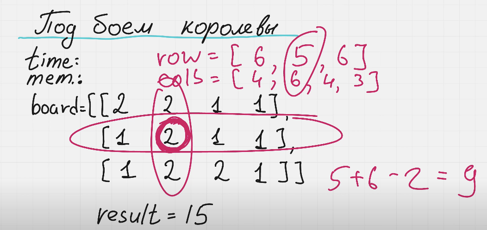
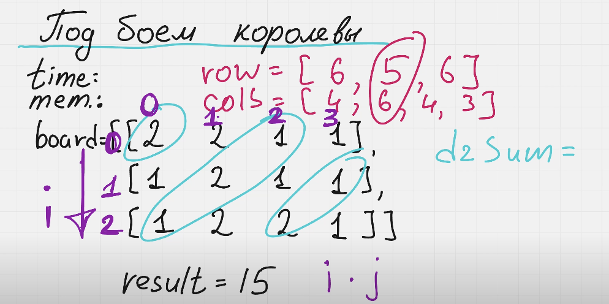

Нам нужно пройтись по всем точкам, определить сумму элементов по горизонтали, вертикали, по главной и побочной диагонали и найти максимальную сумму всех элементов.

Для оптимального решения нужно определить 4 массива. Массивы по горизонтали, вертикали, по главной и побочной диагонали.

У нас есть пример с полем

board := []int{
    {2,2,1,1},
    {1,2,1,1},
    {1,2,2,1}
}
Для этого поля будут следующие массивы
rows = []int{6, 5, 6}
cols = []int{4, 6, 4, 3}

Теперь нам нужно определить массив для главной диагонали.
Нам нужно составить массив d2Sum = []int{2,3,4,4,3,1}
Нам нужно взять 2 элемента: i + j и получить 

d2Sum[0] = 2, что это значит? Это значит, что если у элементов i, j равна 0, 0 i = 0, j = 0. То сумма всех элементов диагонали равна 2.