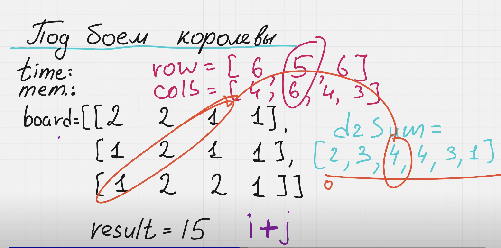
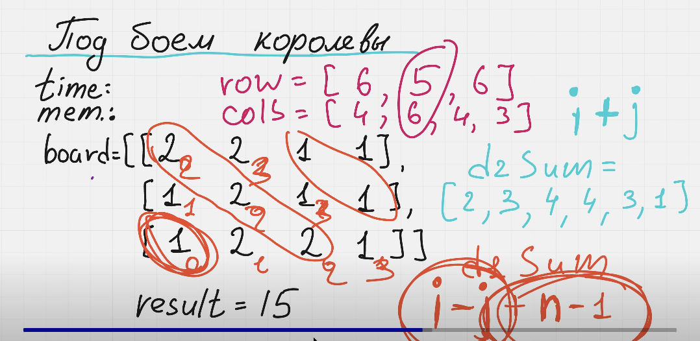

Нам нужно пройтись по всем точкам, определить сумму элементов по горизонтали, вертикали, по главной и побочной диагонали и найти максимальную сумму всех элементов.

Для оптимального решения нужно определить 4 массива. Массивы по горизонтали, вертикали, по главной и побочной диагонали.

У нас есть пример с полем

board := []int{
    {2,2,1,1},
    {1,2,1,1},
    {1,2,2,1}
}
Для этого поля будут следующие массивы
rows = []int{6, 5, 6}
cols = []int{4, 6, 4, 3}

Теперь нам нужно определить массив для главной диагонали.
Нам нужно составить массив d2Sum = []int{2,3,4,4,3,1}
Нам нужно взять 2 элемента, сложить их индексы в массиве board (i + j) и получить сумму элементов в текущей диагонали.

d2Sum[0] = 2, что это значит? Это значит, что если у элементов i, j равна 0, 0 i = 0, j = 0. То сумма всех элементов диагонали равна 2.

Теперь нам нужно определить массив для побочной диагонали.

Нам нужно составить массив d1Sum = []int{1,3,6,4,2,1}

Нам нужно взять 2 элемента, сложить их индексы в массиве board по формуле (i - j + n - 1, где n - количество строк) и получить сумму элементов в текущей диагонали. Если не получается вспомнить формулу на собесе можно использовать (i - j) и хранить сумму в мапе, т.к. она допускает наличие отрицательных ключей.

Пример расчета для i = 0, j = 0

1) Считаем сумму элементов по горизонтали - для строки:
Берем массив rows = []int{6, 5, 6}
Получаем 6 (i = 0)

2) Считаем сумму элементов по вертикали - для столбца:
Берем массив cols = []int{4, 6, 4, 3}
Получаем 4 (j = 0)

3) Считаем сумму элементов для главной диагонали:
Берем массив d2Sum = []int{2,3,4,4,3,1}
Считаем индекс по формуле: i + j = 0 + 0 = 0. Берем d2Sum[0] = 2.

4) Считаем сумму элементов для побочной диагонали:
Берем массив d1Sum = []int{1,3,6,4,2,1}
Считаем индекс по формуле: i - j + n - 1 = 0 - 0 + 3 - 1 = 2. Берем d1Sum[2] = 6.

Итого: 6 + 4 + 2 + 6 - 3 * 2 = 12
Мы текущий элемент посчитали 4 раза. Поэтому нам нужно вычесть его 3 раза (- 3 * 2).

time: O(n * m), n - количество строк, m - количество столбцов
mem: O(n + m + n + m - 1 + n + m - 1) => O(3n + 3m - 2)  => O(n + m)

----

Мы проходимся 1 раз по массиву board и заполняем всем массивы (по вертикали, горизонтали и по двум диагоналям.)
Для заполнения по диагонали используем
d1Sum[i + j] += board[i][j]
d2Sum[i - j + n - 1] += board[i][j]