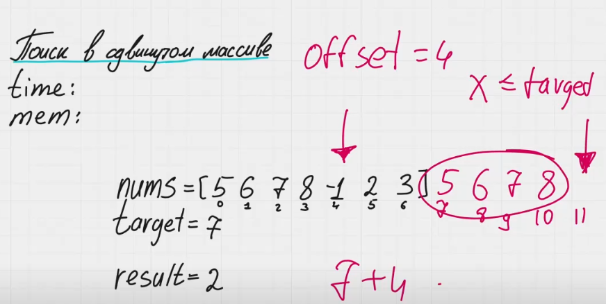

1) Нам нужно использовать бинарный поиск 2 раза.
В первый раз, чтобы найти максимальный элемент и понять смещение - offset.

Для этого берем последний элемент массива и сравниваем его со всеми другими элементами, используя бинарный поиск. Мы находим все элементы, которые больше этого элемента и меньше. На стыке этих элементов, там где заканчивается функция true и false мы получим максимальный и минимальный элемент массива.

Почему именно последний элемент массива? Потому что мы точно знает массив сдвинут. Это значит, что если мы будем брать другой элемент, мы можем нарваться на максимальный элемент массива. В этом случае у нас все значения будут false, стыка не будет и мы никак сможем определить максимальный элемент.

Не забываем проверить: Если `nums[0] < nums[n-1]`, значит **массив не сдвигался**, возвращаем `0` (`offset = 0`). В остальных случаях используем **бинарный поиск по разрыву**.

Если при бинарном поиске мы хотим получить результат, который храниться в первом правом элементе, нам нужно инициализировать левый и правый указатели l := -1, r := len(arr) - 1. Это делается, чтобы обработать случай, когда интересующий нас элемент в индексе массива равный нулю.

Если при бинарном поиске мы хотим получить результат, который храниться в последнем левом элементе, нам нужно инициализировать левый и правый указатели l := 0, r := len(arr).

Далее мы левый указатель поставим на минимальный элемент (offset), а правый на len(arr) + offset, он будет указывать на последний несуществующий индекс.

В нашем примере это будет 
nums = [5, 6, 7, 8, -1, 2, 3]
target = 7 (искомый элемент)

Мы выяснили, что offset = 4. 
l = offset = 4, 
r = len(arr) + offset = 7 + 4 = 11

На картинке мы видим, что мы как будто продлили наш массив, левую часть мы сдвинули и прибавили к правой. По факту искать элементы мы будет в исходном массиве и указатели l и r будут находиться в пределах длины массива.

Вычисляя middle мы воспользуемся классической формулой m = (l + r) / 2 = (4 + 11) / 2 = 7. 7 больше длины массива. Чтобы попасть в реальный элемент к этому значению мы используем операцию остатка от деления от длины массива и получаем 0. Там и находиться наш элемент. 
index := m % len(arr) = 7 % 7 = 0. arr[0] = 5

Далее мы делаем тоже самое для других значений.
m = (l + r) / 2 = (7 + 11) / 2 = 9.
index := m % len(arr) = 9 % 7 = 2. arr[2] = 7

На последней итерации будет
m = (l + r) / 2 = (9 + 11) / 2 = 10.
index := m % len(arr) = 10 % 7 = 3. arr[3] = 8.

Мы сдвинем на индекс [3] правый указатель, а левый указатель будет ссылаться на индекс [2]. Там и будет лежать наш интересующий ответ.

Ну и в конце мы смотрим равен ли элемент на котором стоит левый указатель target.

Если да, то возвращаем индекс этого элемента - левый указатель, если нет, то возвращаем -1.
