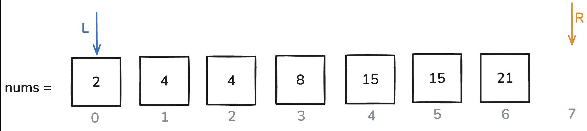
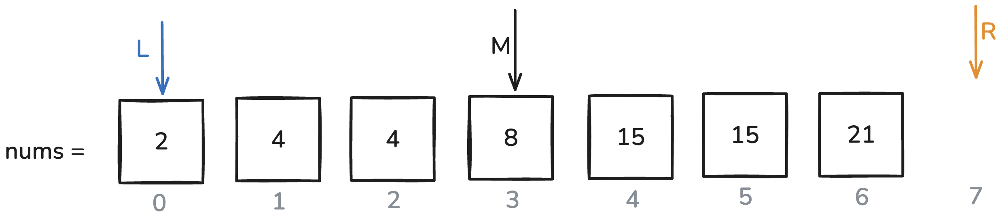
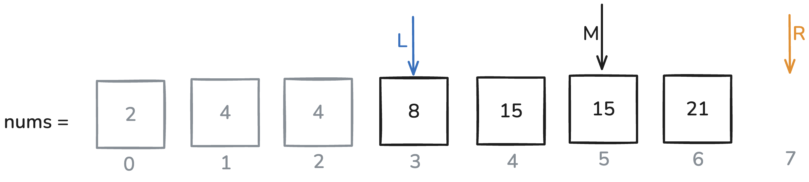
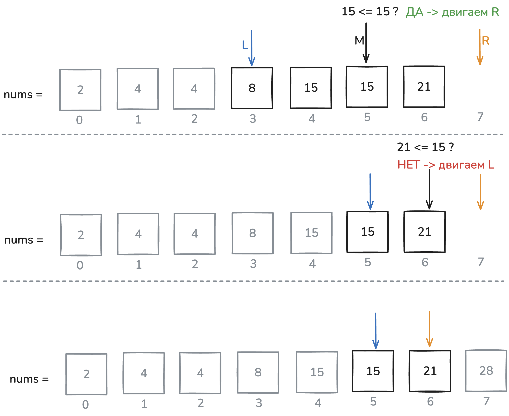
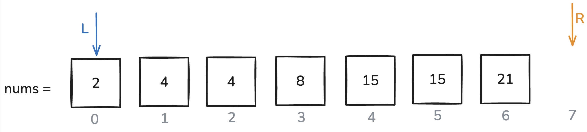

Основы бинарного поиска
В этом уроке ты
Поймешь, что такое бинарный поиск и в чем его преимущество.
Решишь задачу с собеседования методом бинарного поиска.
На практике оценишь время и память, которые тратит решение, используя Big O нотацию.
Зачем нужен бинарный поиск

Представь, что у тебя есть уже отсортированный массив, например: nums = [1, 3, 4, 5, 8, 15, 15, …], в котором 128 элементов. И тебе нужно проверить, есть ли в этом массиве число x.

Линейный поиск
Самое простое решение — линейный поиск, который просто идет по всем элементам слева направо и сравнивает каждый с x:

``` Go
package main

import "fmt"

func search(nums []int, x int) bool {
    for _, num := range nums {
        if num == x {
            return true
        }
    }
    return false
}
```
Даже если учесть, что массив отсортирован, и остановить цикл, когда текущее число стало больше x:  

``` Go
package main

import "fmt"

func search(nums []int, x int) bool {
    i := 0
    for i < len(nums) && nums[i] <= x {
        if nums[i] == x {
            return true
        }
        i++
    }
    return false
}
```

Все равно в худшем случае может понадобиться посмотреть почти на каждый элемент (если x окажется в конце или его вовсе не окажется). Такой поиск работает за O(n), то есть время поиска растет пропорционально количеству элементов.

Бинарный поиск
Бинарный поиск позволяет работать гораздо быстрее — за O(log(n)). Бинарный поиск элемента в массиве размером 1024 займет всего 10 шагов вместо 1024 при линейном поиске. А при размере 1 048 576 - всего 20.

Что такое бинарный поиск
Бинарный поиск — это алгоритм, который эффективно находит нужный элемент в отсортированном массиве.

Во многих языках программирования есть готовые методы, которые делают это за нас. Но на собеседованиях часто просят написать бинарный поиск самостоятельно.

Почему бинарный поиск быстрый
Допустим, у нас есть массив [2, 4, 4, 8, 14, 15, 21], и мы хотим узнать, есть ли в нем число 15.



Шаг 1: заводим два указателя.

L (левый) — в начале стоит на индексе 0
R (правый) — обычно ставим на индекс len(nums), то есть один элемент «за концом» массива.
Это немного непривычно, ведь мы указываем за границу массива, но так алгоритм получится проще и избежит лишних проверок.



Шаг 2: находим середину.

Вычислим M = (L + R) // 2, то есть средний индекс.
Сравним nums[M] с искомым числом (15 в нашем примере).



Шаг 3: двигаем указатели.

Если nums[M] <= 15, значит наша цель точно не «левее» индекса M (ибо там элементы еще меньше). Поэтому мы «подвигаем» левый указатель L на середину M.
Если nums[M] > 15, то, наоборот, двигаем правый указатель R на M, так как все элементы правее M могут оказаться слишком большими.



Шаг 4, 5, …: Повторяем эти шаги, пока R - L > 1, т.е. пока R и L не окажутся рядом.

Получаем ответ: Когда L и R сойдутся вплотную, мы проверим элемент по индексу L, чтобы понять, равен ли он 15.

В результате у нас постоянно уменьшается диапазон, где может быть искомое число. Вместо того чтобы просматривать все элементы подряд, мы каждую итерацию «отсекаем» половину вариантов, и поэтому работаем значительно быстрее.


``` Go
package main

import "fmt"

func search(nums []int, target int) bool {
    l, r := 0, len(nums)
    for r-l > 1 {
        m := (l + r) / 2
        if nums[m] <= target {
            l = m
        } else {
            r = m
        }
    }
    return nums[l] == target
}
```

Когда цикл завершается, l указывает на позицию, где находится последний элемент, не превышающий target. Если nums[l] совпадает с target, мы возвращаем true. Если нет — false.

Почему R = len(nums)



Теперь к вопросу, почему мы ставим R не на len(nums) - 1, а именно на len(nums).

Искомый элемент может оказаться последним (к примеру, 21 в массиве [2, 4, 4, 8, 14, 15, 21]). Если бы мы изначально поставили R = len(nums) - 1, то при поиске последнего элемента бинарный поиск завершится неправильно.
Ставя R = len(nums), мы избавляемся от лишних проверок (алгоритм сам никогда не «выйдет» за границы реального массива) и получаем аккуратное условие выхода из цикла.
Установка R = len(nums) — это удобный трюк, чтобы проще обрабатывать случаи поиска элемента в самом конце массива, без дополнительных условий.
Результат и выводы
Скорость: бинарный поиск отбрасывает половину массива на каждом шаге и за счет этого работает намного быстрее линейного поиска.

Оценка сложности: бинарный поиск в массиве из n элементов будет работать за O(log(n)) по времени и O(1) по дополнительной памяти.

Важность сортировки: когда выполняем классический бинарный поиск, то массив должен быть обязательно отсортирован, но в дальнейшем ты научишься применять метод бинарного поиска даже для данных, где нет сортировки.

