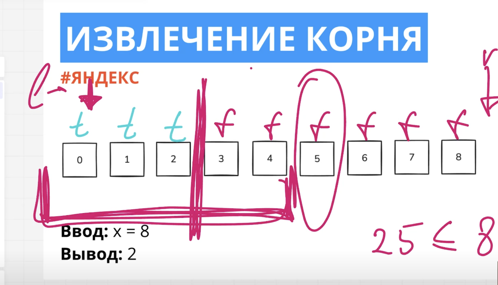

Сначала нам нужно определить диапозон допустимых значений. Он будет от 0 до х. Где-то в этом дапозоне будет находиться корень из числа х.

Далее нам нужно определить какие элементы нам подходят, а какие нет. Мы делим элементы на "хорошие" и "плохие".

Очень важная мысль. Может быть такая ситуация, когда у нас нужный элемент массива выходит за пределы интересующих значений. Чтобы такого не случилось мы смещаем правый указатель на 1.
Например: У нас есть последовательность от 0 до 1. Если мы ставим указатели l = 0 и r = 1, то у нас сразу срабаывает условие выхода из цикла и нужное значение (1) мы не найдем. Чтобы избежать этой ситуации мы r указатель смещаем на 1.

В этом случае у нас будет:
l = 0; r = x + 1;

Чтобы решить нашу задачу нам нужно воспользоваться формулой y ^ 2 <= x

Бинарный поиск во всех задачах будет выглядеть одинаково.

Теперь нам нужно определить, как мы будем смещать наши указатели.
В нашей последовательности мы берем средний элемент - middle. И смотрим, подходит ли он по условию - y ^ 2 <= x. У нас на входит приходит x = 8. middle указывает на элемент равный 5, мы возводим 5 в квадрат и смотрим соблюдается ли условие. Условие не соблюдается, значит все что справа нас не интересует. Теперь нас интересует левый отрезок.

24:10

 