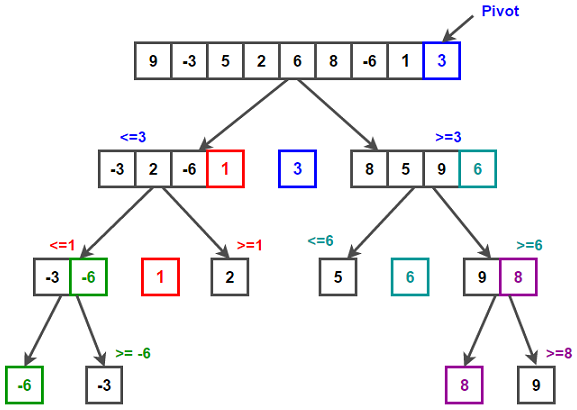

### Быстрая сортировка, Quick Sort

Что здесь происходит?
Мы выбираем опорный элемент (pivot), это последний элемент в массиве. Делим текущий массив на две части, то что больше опорного элемента и то что меньше. У этих подмассивов тоже выбираем опорный элемент и их тоже делим 2 большую и меньшую часть. Проделываем эту операцию до тех пор пока в подмассивах не останется по одному элементу. Когда мы дойдем до конца у нас уже будет отсортированный массив. Далее мы рекурсивно возвращаемся на уровень выше и собираем части массива в один целый.