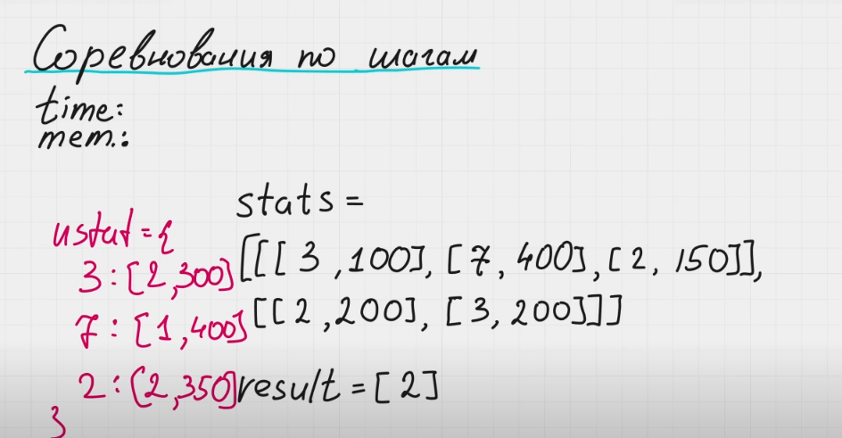
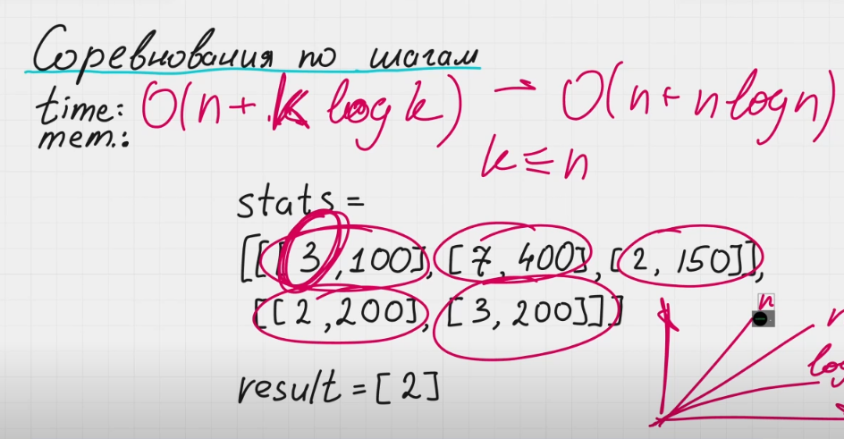

Соревнования по результатам шагов

Уровень сложности - средне

Недавно закончился чемпионат по шагам, и тебе нужно подвести его итоги! Дан массив statistics, где statistics[i] = [[id участника, число шагов в i-ый день], ...]. Нужно было вернуть id всех участников, которые прошли наибольшее число шагов и одновременно с этим принимали участие в соревнованиях каждый день . Результат можно вернуть в любом порядке.

Если ни один из участников не принимал участие в соревнованиях каждый день, то нужно вернуть пустой массив.

Пример 1:

Ввод: статистика =
[[[1,1000],[2,3500]]
,[[1,1500]]]
Вывод: [1]
Объяснение: каждый день в соревнованиях участвовал только участник с id=1.

Пример 2:
Ввод: статистика =
[[[2,4000],[9,500],[4,2000],[6,1000]]
,[[9,5000],[2,1500],[4,5500],[6,2000]]
,[[2,3420],[9,10000],[6,10850],[4,8000]]]
Вывод: [9,4]
Объяснение: все участники принимали участие каждый день, но участники с id=9 и id=4 выполнили больше всего шагов.

Ограничение:
len(statistics) >= 1

------

Пример:

stats =
[
    [[3, 100], [7, 400], [2, 150]],
    [[2, 200], [3, 200]]
]

result = [2]

В ответе могут быть несколько идентификаторов. Если победили несколько участников, результат вернуть в отсортированном порядке.

Решение:
Заведем хэш-таблицу ustat (users stats). Ключ - идентификатор участника, значение - количество пройденных шагов и количество дней участия в соревновании.

Пройдемся по массиву stats и заполним хэш-таблицу ustat.

users = {
    3: [2, 300],
    7: [1, 400],
    2: [2, 350]
}

Пройдемся по хэш-таблице ustat. Заведем переменную max для поиска максимального значения. Проверяем участвовал ли участник во всех днях соревнования.

Пройдемся по хэш-таблице ustat снова и найдем всех участников, у которых количество пройденных шагов равно переменной max. Id этих пользователей вернем в результате.

Два прохода по хэш-таблице ustat можно объединить в один.

time: O(n + k log k), где n - количество записей о сореновнованиях, в нашем случае таких записей 5 шт. Хэш-таблица ustat не может у нас не может быть больше чем массив stats. Проходя по ней можно сказать, что мы это делаем за дополнительное O(n).
Ответ нам так же нужно отсортировать, это мы делаем за k log k, где k - число возможных вариантов ответа. В самом плохом случае k может быть равно n.
Оценку O(n + k log k) можно привести к O(n + n log n)

mem: O(n). Потому что в самом худшем случае у нас может быть число возможных вариантов ответа равно количеству всех записей.

