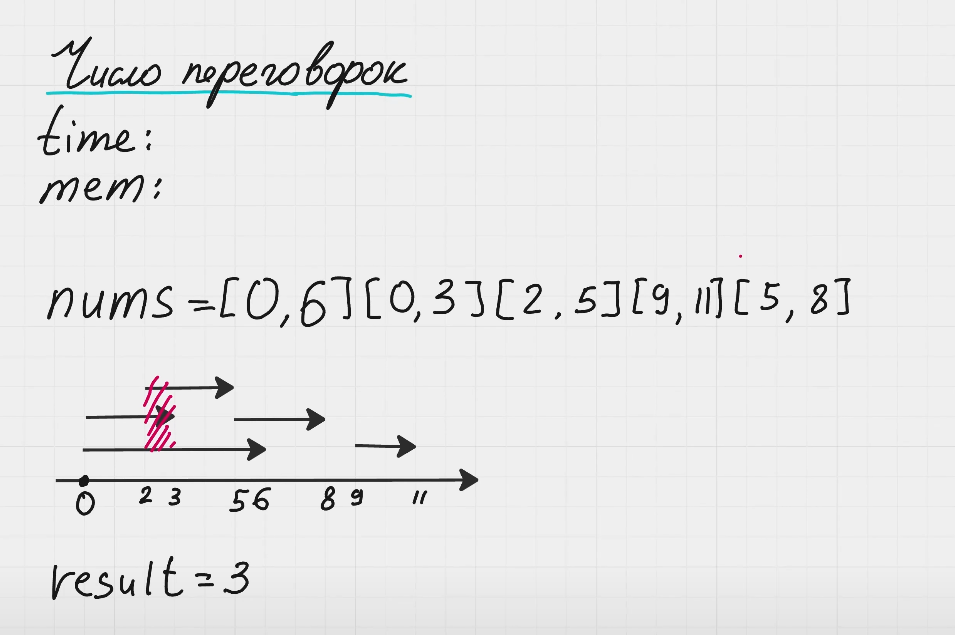

Нам очень важно понимать, когда человек выходит из переговорки, а когда другой человек заходит. 

Если у нас есть 2 интервала [0, 6] и [6, 8], в этом случае сначала один человек выходит, а потом заходит. И нам для такой ситуации нужна только одна переговорка.

Если к этому интервалу прибавляется еще один [3, 5], нам нужна еще одна переговорка.

В нашем примере nums = [[0,6][0,3][2,5][9,11][5,8]], который после сортировки дает nums = [[0,3][0,6][2,5][5,8][9,11]], первые интервала пересекаются в интервале [2,3]. Значит нам нужно 3 переговорки, это и есть наш результат.

Нам нужно разделить все наши интервалы на 2. Допустим интервал [0,6] станет [0,+1] [6,-1]. Первая точка говорит о том, когда человек зашел, а вторая когда вышел. 