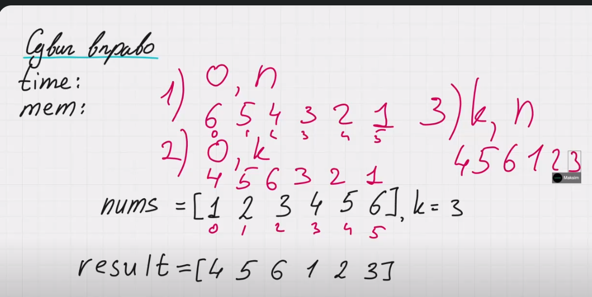
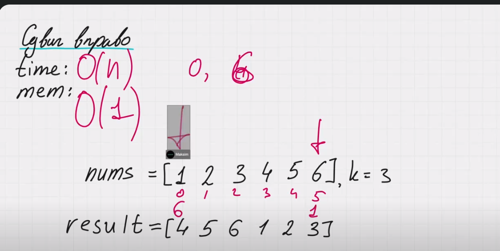

Задача: 189. Rotate Array (Сдвиг вправо)

Описание задачи:
Вам дан массив nums длины n и целое неотрицательное число k. Необходимо "повернуть" массив вправо на k шагов, где k может быть больше n. Это означает, что каждый элемент массива перемещается на k позиций вправо, а элементы, которые выходят за пределы массива, возвращаются в начало.

-----

nums = [1, 2, 3, 4, 5, 6], k = 3
result = [4, 5, 6, 1, 2, 3]

Мы не создаем новый массив, мы возвращаем текущий измененный (in place).

Чтобы обработать случай, когда у нас k больше размера массива. Нужно проделать взять остаток от деления на размера массива n.
1) k = k % n

Для разворота нам нужно выполнить 3 операции:
2) Полностью развернуть массив.
nums = [6, 5, 4, 3, 2, 1]
3) Развернуть левую часть (от 0 до k).
nums = [4, 5, 6, 3, 2, 1]
4) Развернуть правую часть (от k до n).
nums = [4, 5, 6, 1, 2, 3]

В случае k = 0, проделая все указанные выше операции мы получить тот же самый массив. Мы конечно, может отбработать этот случай в самом начале, но это не требуется.

Разворот массива можно сделать с помощью двух указателей (один двигается с начала, второй с конца).

